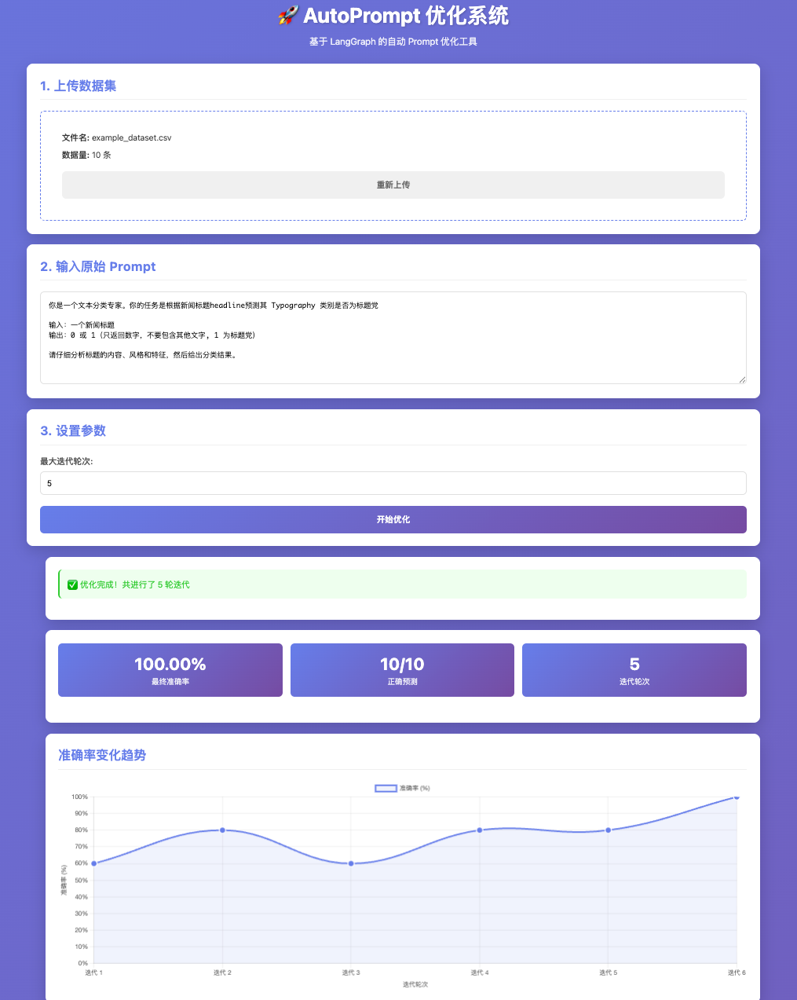
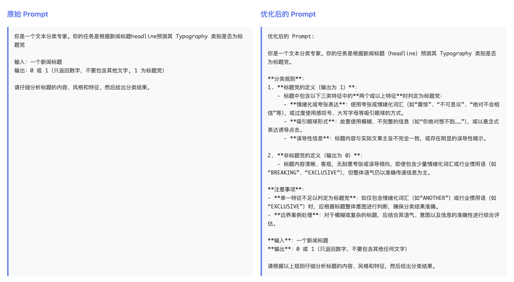
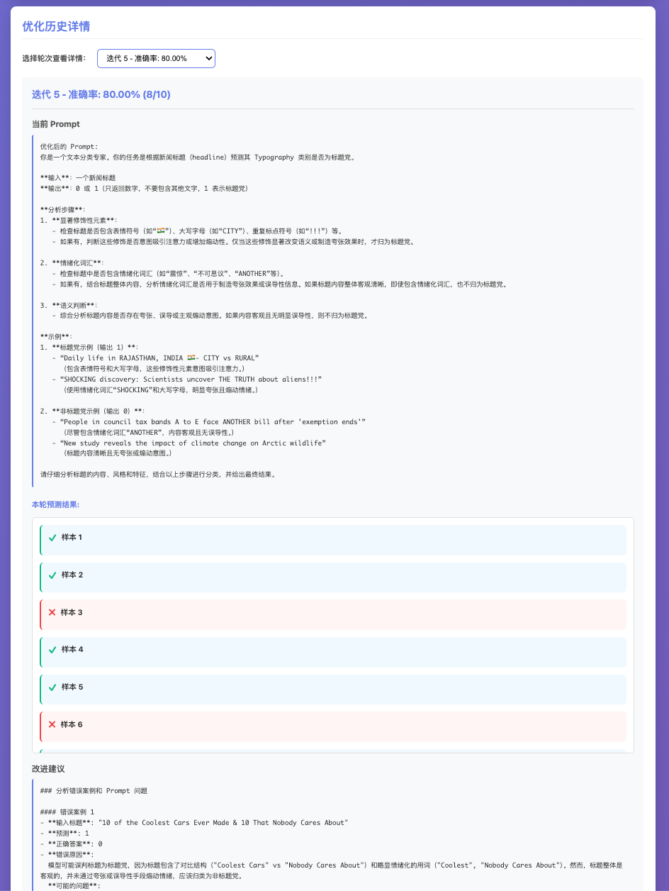
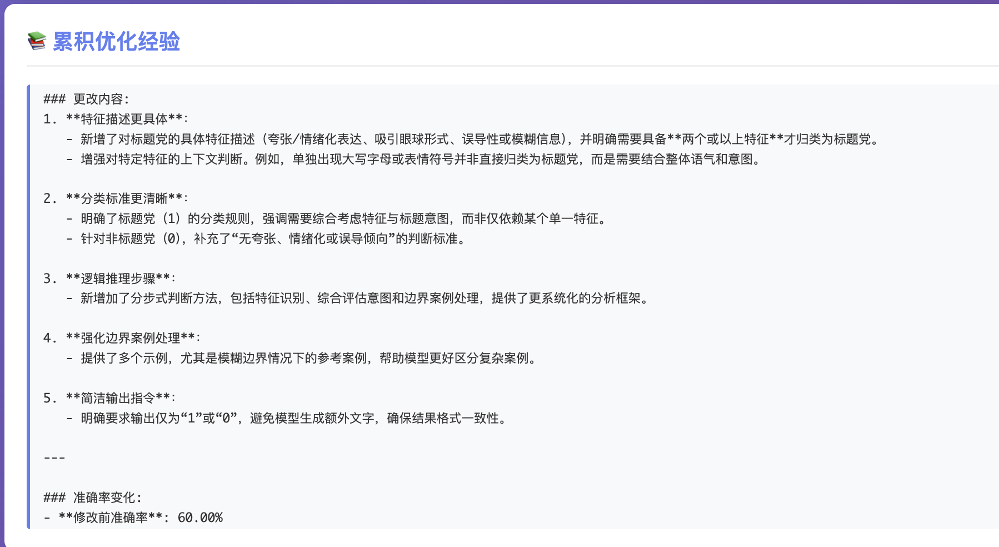

# AutoPrompt with LangGraph

基于 LangGraph 的自动 Prompt 优化系统，使用 Flask 提供 Web 界面。

## 呈现效果

### 1. 系统主界面



系统主界面包含数据集上传、Prompt 输入、参数设置等功能，优化完成后会显示准确率指标和变化趋势图。

### 2. Prompt 优化对比



系统会自动优化 Prompt，左侧显示原始 Prompt，右侧显示优化后的详细 Prompt（包含分析步骤、判断标准、示例等）。

### 3. 优化历史详情



通过下拉框可以选择查看任意轮次的详细信息，包括当前 Prompt、所有预测结果（正确/错误标记）以及改进建议。

### 4. 累积优化经验（Memory）



系统会自动总结每次优化的经验，包括迭代轮次、更改内容、准确率变化、案例变化分析和优化建议，形成可复用的知识库，供后续优化参考。

## 功能特性

- 📁 上传数据集文件（CSV/JSON/JSONL）
- ✍️ 输入原始 Prompt
- ⚙️ 设置最大迭代轮次
- 🤖 四个 Agent 协作优化：
  1. **预测 Agent**: 根据数据集和当前 prompt 进行预测
  2. **分析 Agent**: 分析错误案例并给出修改意见
  3. **改写 Agent**: 根据分析结果和历史经验改写 Prompt
  4. **记忆 Agent**: 从 prompt 更改和准确率变化中总结经验，形成可复用的优化知识库
- 🔄 自动循环优化直到达到最大迭代次数或所有预测正确
- 🧠 **智能记忆机制**：每次优化都会总结通用经验，并应用于后续优化过程
- 📂 **实验隔离**：每次任务自动创建独立的实验文件夹，不同任务互不干扰

## 工作流程

```
开始
  ↓
[预测 Agent] → 使用当前 prompt 对数据集进行预测
  ↓
[分析 Agent] → 分析错误案例，给出改进建议
  ↓
[改写 Agent] → 根据建议和历史经验改写 prompt
  ↓
[记忆 Agent] → 从 prompt 更改和准确率变化中总结经验
  ↓
判断是否继续？
  ├─ 是 → 增加迭代次数 → 回到预测 Agent
  └─ 否 → 结束，返回优化后的 prompt
```

### Memory 机制说明

系统引入了 **Memory Agent（记忆 Agent）**，它会在每次迭代后：

1. **总结经验**：分析 prompt 的更改内容、准确率变化趋势、具体案例的变化情况
2. **生成经验文档**：将总结的经验保存到独立的实验文件夹中
3. **应用经验**：在后续的改写过程中，Rewrite Agent 会参考这些历史经验来优化 prompt

**经验总结包含**：
- 📊 迭代轮次和准确率变化趋势（上升/下降）
- 📝 Prompt 的具体更改内容（通过 diff 展示）
- 🎯 案例变化分析（哪些案例从错误变正确，哪些从正确变错误）
- 💡 后续优化方向的建议
- 🔑 可复用的优化原则

**实验隔离**：
- 每次优化任务会自动生成唯一的 `experiment_id`
- 每个任务的经验文件保存在 `experiments/{experiment_id}/memory_experiences.txt`
- 不同任务之间的经验互不干扰，便于对比和管理

## 安装

1. 克隆或下载项目

2. 创建虚拟环境（推荐使用 conda）：
```bash
conda create -y python=3.10 -n AutoPrompt
conda activate AutoPrompt
```

3. 安装依赖：
```bash
pip install -r requirements.txt
```

**注意**：如果使用其他虚拟环境工具（如 venv），也可以：
```bash
python -m venv venv
source venv/bin/activate  # Windows: venv\Scripts\activate
pip install -r requirements.txt
```

## 配置

### 配置 API Key

本项目支持两种 LLM 服务，你只需要配置其中一种：

1. **OpenAI**（标准 OpenAI API）
2. **Azure OpenAI**（Azure 上的 OpenAI 服务）

#### 方式一：使用 OpenAI（标准 OpenAI API）

**使用 .env 文件（推荐）**：

1. 复制示例配置文件：
```bash
cp .env.example .env
```

2. 编辑 `.env` 文件，将 `your_openai_api_key_here` 替换为你的实际 API Key：
```
OPENAI_API_KEY=sk-xxxxxxxxxxxxxxxxxxxxxxxxxxxxxxxx
```

**获取 API Key**：
- 访问 https://platform.openai.com/api-keys
- 登录你的 OpenAI 账号
- 点击 "Create new secret key" 创建新的 API Key
- 复制生成的 Key（只显示一次，请妥善保存）

#### 方式二：使用 Azure OpenAI

**使用 .env 文件（推荐）**：

1. 复制示例配置文件：
```bash
cp .env.example .env
```

2. 编辑 `.env` 文件，取消注释 Azure OpenAI 相关配置，并填入你的实际值：
```
AZURE_OPENAI_API_KEY=你的Azure_API密钥
AZURE_OPENAI_ENDPOINT=https://your-resource-name.openai.azure.com/
AZURE_OPENAI_DEPLOYMENT_NAME=你的部署名称（如 gpt-35-turbo）
AZURE_OPENAI_API_VERSION=2024-02-15-preview
```

**获取 Azure OpenAI 配置信息**：
- 在 Azure Portal 中，进入你的 Azure OpenAI 资源
- 在 "Keys and Endpoint" 页面可以找到 API Key 和 Endpoint
- 在 "Deployments" 页面可以看到部署名称

**注意**：
- 如果同时配置了 OpenAI 和 Azure OpenAI，系统会**优先使用 Azure OpenAI**
- 详细配置说明请查看 [CONFIG.md](CONFIG.md)

## 运行

```bash
python app.py
```

然后访问 http://localhost:5000

## 使用说明

1. **上传数据集**
   - 支持 CSV、JSON、JSONL 格式
   - CSV 文件应包含 `input` 和 `ground_truth` 列（或类似名称）
   - JSON/JSONL 文件应包含 `input` 和 `ground_truth` 字段
   - 💡 **快速测试**：可以直接使用项目中的 `example_data/example_dataset.csv`

2. **输入原始 Prompt**
   - 在文本框中输入你的初始 prompt
   - Prompt 应该描述任务要求和期望的输出格式
   - 💡 **快速测试**：可以复制 `example_data/example_prompt.txt` 中的内容

3. **设置参数**
   - 设置最大迭代轮次（1-20，建议先用 3-5 次测试）
   - 点击"开始优化"按钮

4. **查看结果**
   - 系统会自动进行多轮优化
   - 显示准确率变化折线图
   - 显示最终优化后的 prompt（与原始 prompt 对比）
   - 显示累积的优化经验（Memory Agent 总结的经验）
   - 通过下拉框查看每轮迭代的详细结果（prompt、预测结果、改进建议）
   - 系统会返回 `experiment_id`，可用于追踪本次实验

5. **查看经验文件**
   - 每次任务的经验总结保存在 `experiments/{experiment_id}/memory_experiences.txt`
   - 经验文件包含了详细的优化过程记录和通用原则
   - 可以在前端界面直接查看累积的经验内容

## 数据集格式示例

项目提供了示例数据在 `example_data/` 目录中，你可以直接使用它们进行测试。

### CSV 格式示例

`example_data/example_dataset.csv` 是一个文本分类任务的数据集：

```csv
itemId	Headline	Typography
jxMuJYMZn7BCIg	Daily life in RAJASTHAN, INDIA 🇮🇳- CITY vs RURAL	1
BB1pyNbo	Review: INSANE 8-across Business Class on United's 777-200	1
AA1oW3oj	10 of the Coolest Cars Ever Made & 10 That Nobody Cares About	0
AA1okiqu	BLACK FOREST Mega Cake!! _ How To Cake It	1
```

**说明**：
- `Headline` 列会被自动识别为输入列
- `Typography` 列会被自动识别为标准答案列（0 或 1）
- `itemId` 列会被保留但不参与预测

### JSON 格式示例

```json
[
  {
    "input": "Daily life in RAJASTHAN, INDIA 🇮🇳- CITY vs RURAL",
    "ground_truth": "1"
  },
  {
    "input": "10 of the Coolest Cars Ever Made & 10 That Nobody Cares About",
    "ground_truth": "0"
  }
]
```

### JSONL 格式示例

```jsonl
{"input": "Daily life in RAJASTHAN, INDIA 🇮🇳- CITY vs RURAL", "ground_truth": "1"}
{"input": "10 of the Coolest Cars Ever Made & 10 That Nobody Cares About", "ground_truth": "0"}
```

## 项目结构

```
autoprompt-langgraph/
├── app.py                 # Flask 主应用
├── graph.py               # LangGraph 工作流
├── utils.py               # 工具函数（文件处理、数据加载）
├── agents/                # Agent 模块
│   ├── __init__.py        # 模块初始化
│   ├── prediction_agent.py # 预测 Agent
│   ├── analysis_agent.py   # 分析 Agent
│   ├── rewrite_agent.py   # 改写 Agent
│   └── memory_agent.py    # 记忆 Agent（总结经验）
├── templates/             # HTML 模板
│   └── index.html         # 主页面
├── static/                # 静态文件
│   ├── style.css          # 样式文件
│   └── script.js          # 前端脚本
├── docs/                  # 文档目录
│   └── images/            # 图片资源
│       ├── image.png              # 系统主界面截图
│       ├── image2.png             # Prompt 对比图
│       └── image3.png             # 优化历史详情图
├── experiments/           # 实验数据目录（自动创建）
│   └── {experiment_id}/   # 每次任务的独立文件夹
│       └── memory_experiences.txt # 经验总结文件
├── uploads/               # 上传文件目录（自动创建）
├── example_data/          # 示例数据目录
│   ├── example_dataset.csv # 示例数据集
│   └── example_prompt.txt  # 示例 prompt
├── .env.example           # 环境变量配置示例文件
├── requirements.txt       # 依赖包
└── README.md              # 说明文档
```

## 技术栈

- **LangGraph**: 构建工作流图
- **LangChain**: LLM 调用和 Prompt 管理
- **Flask**: Web 框架
- **OpenAI API**: LLM 服务

## 注意事项

1. 需要有效的 OpenAI API Key
2. 优化过程可能需要较长时间，取决于数据集大小和迭代次数
3. 建议先用小数据集测试
4. 确保数据集包含 `ground_truth` 字段用于评估
5. 每次任务的经验文件会保存在 `experiments/` 目录下，目录会自动创建
6. Memory Agent 会在第二次迭代及以后才开始总结经验（第一次迭代没有历史数据可对比）

## 示例 Prompt

项目提供了示例 prompt 在 `example_data/example_prompt.txt`，这是一个文本分类任务的 prompt：

```
你是一个文本分类专家。你的任务是根据新闻标题headline预测其 Typography 类别是否为标题党

输入：一个新闻标题
输出：0 或 1（只返回数字，不要包含其他文字, 1 为标题党）

请仔细分析标题的内容、风格和特征，然后给出分类结果。
```

**使用示例数据测试**：
1. 上传 `example_data/example_dataset.csv` 作为数据集
2. 复制 `example_data/example_prompt.txt` 中的内容作为原始 prompt
3. 设置迭代次数（建议 3-5 次）
4. 点击"开始优化"进行测试

## 许可证

MIT License

